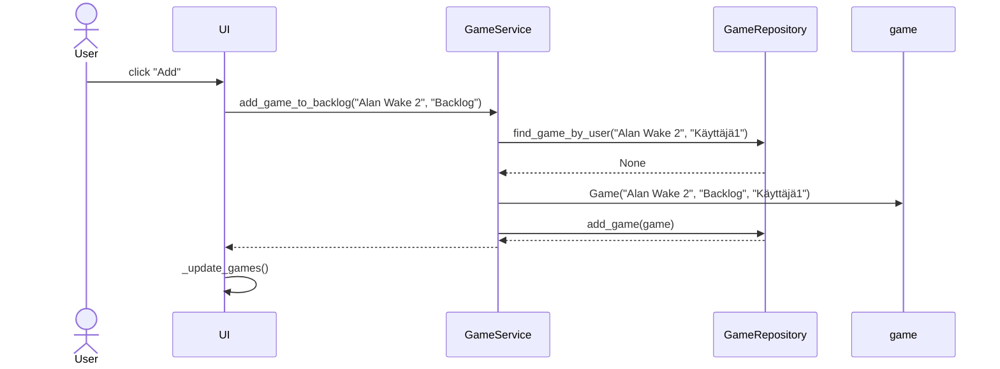

# Arkkitehtuurikuvaus
## Sovelluksen rakennekuvaus
Sovelluksen rakenne on jaettu neljään osaan: **ui**, **services**, **repositories** ja **entities**, missä **ui** vastaa käyttöliittymästä, **services** vastaa sovelluslogiikasta, **repositories** vastaa tietojen tallennuksesta tietokantaan ja **entities** sisältää luokat käsiteltäville olioille.

## Sovelluslogiikan kuvaus
Luokka GameService vastaa sovelluslogiikasta ja sen metodeja suoritetaan käyttöliittymän kautta. Metodit toteuttavat käyttäjien rekisteröinnin ja kirjautumisen sekä pelien hallinnan. GameService hallitsee Game- ja User-luokkien olioita GameRepository- ja UserRepository-luokkien kautta.

### Sovelluksen luokkien suhdetta kuvaava luokkakaavio:

### Sekvenssikaavio pelin lisäämiselle:

Käyttöliittymästä eli UI-luokasta kutsutaan GameService-luokan metodia add_game_to_backlog, johon on syötetty lisättävän pelin nimi ja tila. GameService tarkistaa onko peli jo lisätty backlogiin kutsumalla GameRepository-luokan metodia find_game_by_user, johon on syötetty pelin nimi ja kirjautuneen käyttäjän käyttäjänimi. GameRepository palauttaa None eli peliä ei vielä löydy käyttäjän backlogista. GameService luo lisättävästä pelistä Game-olion, joka sisältää pelin nimen, tilan ja käyttäjänimen. GameService kutsuu GameRepository metodia add_game, jolla juuri luotu olio lisätään tietokantaan. Tämän jälkeen UI-luokka kutsuu metodiaan _update_games ja käyttöliittymässä näytettävät pelit päivittyvät.
