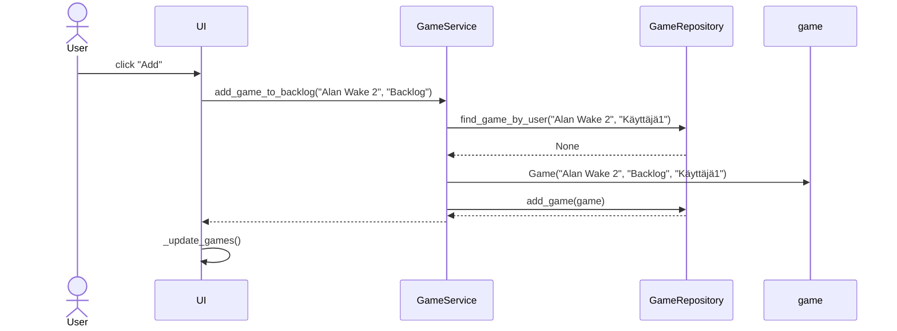

## Pelin lisääminen
Sekvenssikaavio pelin lisäämiselle:

```mermaid
sequenceDiagram
actor User
participant UI
participant GameService
participant GameRepository
participant game
User->>UI: click "Add"
UI->>GameService: add_game_to_backlog("Alan Wake 2", "Backlog")
GameService->>GameRepository: find_game_by_user("Alan Wake 2", "Käyttäjä1")
GameRepository-->>GameService: None
GameService->>game: Game("Alan Wake 2", "Backlog", "Käyttäjä1")
GameService->>GameRepository: add_game(game)
GameRepository-->>GameService:
GameService-->>UI:
UI->>UI: _update_games()
```
