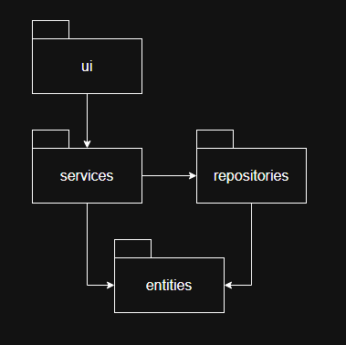
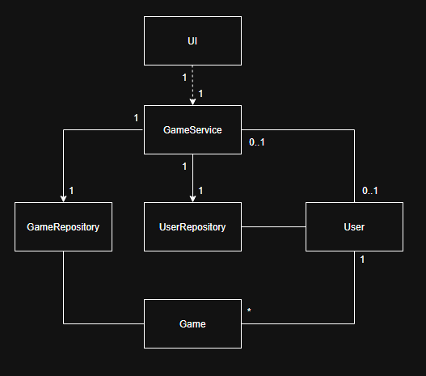
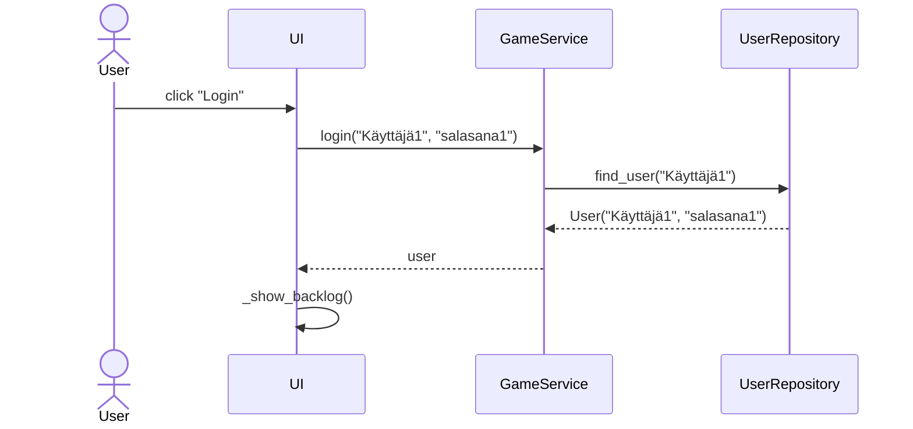
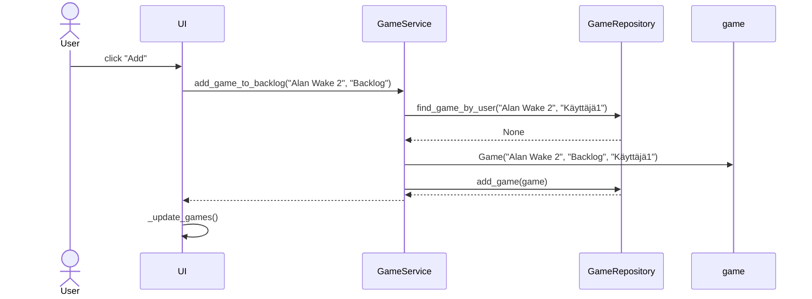
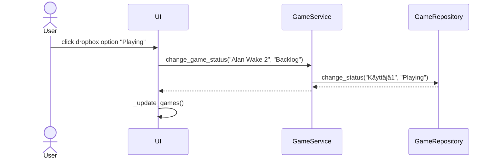

# Arkkitehtuurikuvaus
## Sovelluksen rakennekuvaus
Sovelluksen rakenne on jaettu neljään osaan: **ui**, **services**, **repositories** ja **entities**, missä **ui** vastaa käyttöliittymästä, **services** vastaa sovelluslogiikasta, **repositories** vastaa tietojen tallennuksesta tietokantaan ja **entities** sisältää luokat käsiteltäville olioille.

### Sovelluksen rakennetta kuvaava pakkauskaavio:

## Sovelluslogiikan kuvaus
Luokka `GameService` vastaa sovelluslogiikasta ja sen metodeja suoritetaan käyttöliittymän kautta. `User`-luokka kuvaa käyttäjää ja `Game`-luokka kuvaa käyttäjän lisäämää peliä. `GameService`-luokan metodit toteuttavat käyttäjien rekisteröinnin ja kirjautumisen sekä pelien hallinnan `GameRepository`- ja `UserRepository`-luokkien avulla.

Sovelluksen luokkien suhdetta kuvaava luokkakaavio, jossa UI tarkoittaa ui-hakemiston kaikkia luokkia:

## Käyttöliittymä
Sovelluksessa on kolme näkymää:
- Kirjautuminen
- Rekisteröityminen
- Backlog

ja yksi ponnahdusikkuna:
- Tilojen nimien muokkaaminen

Näkymät ja ponnahdusikkuna ovat toteutettu omina luokkina. `UI`-luokka hallinnoi näitä näkymiä. Käyttöliittymä suorittaa sovelluslogiikan toimintoja kutsumalla `GameService`-luokan metodeja.

## Tietojen pysyväistallennus
Luokat `UserRepository` ja `GameRepository` hoitavat tietojen tallentamisen SQLite-tietokantaan. Käyttäjät tallennetaan tauluun `users` ja käyttäjän lisäämät pelit tauluun `games`. `users` taulussa on käyttäjänimi, salasana ja käyttäjään sidonnaiset muokattavat tilojen nimet. `games` taulussa on pelin nimi, tila ja sen lisänneen käyttäjän käyttäjänimi.

## Sovelluksen päätoiminnalisuudet
Alla on sekvenssikaavioita, jotka kuvaavat sovelluksen päätoiminnallisuuksia.

### Sekvenssikaavio käyttäjän kirjautumiselle:

Käyttöliittymästä painetaan nappia "Login" ja kutsutaan `GameService`-luokan metodia login, jonka parametrit ovat käyttäjänimi ja salasana. `GameService` kutsuu `UserRepository`-luokan metodia find_user, jonka parametri on käyttäjänimi. `UserRepository` palauttaa `User`-olion, koska käyttäjänimi löytyy tietokannasta. `GameService` tarkistaa onko aiemmin annettu salasana sama kuin palautetun `User`-olion salasana. Salasanat ovat samat, joten `GameService` palauttaa user ja käyttöliittymä kutsuu metodiaan _show_backlog.

### Sekvenssikaavio pelin lisäämiselle:

Käyttöliittymästä painetaan pelin lisäys nappia "add" ja kutsutaan `GameService`-luokan metodia add_game_to_backlog, jonka parametrit ovat lisättävän pelin nimi ja tila. `GameService` tarkistaa onko peli jo lisätty backlogiin kutsumalla `GameRepository`-luokan metodia find_game_by_user, johon on syötetty pelin nimi ja kirjautuneen käyttäjän käyttäjänimi. `GameRepository` palauttaa None eli peliä ei vielä löydy käyttäjän backlogista. `GameService` luo lisättävästä pelistä `Game`-olion, joka sisältää pelin nimen, tilan ja käyttäjänimen. `GameService` kutsuu `GameRepository` metodia add_game, jolla juuri luotu olio lisätään tietokantaan. Tämän jälkeen käyttöliittymä kutsuu metodiaan _update_games ja käyttöliittymässä näytettävät pelit päivittyvät.

### Sekvenssikaavio pelin tilan muuttamiselle:

Käyttöliittymästä valitaan pelin tilaksi "Playing" ja käyttöliittymä kutsuu `GameService`-luokan metodia change_game_status, jossa parametreina on pelin nimi ja sen nykyinen tila. `GameService`-luokan change_game_status metodi kutsuu `GameRepository`-luokan metodia change_status, jonka parameteina on kirjautuneen käyttäjän nimi ja pelin uusi tila. `GameRepository` päivittää pelin uuden tilan tietokantaan. Tämän jälkeen käyttöliittymä kutsuu metodiaan _update_games ja käyttöliittymässä näkyvät pelit päivittyvät, jolloin uusi tila näkyy.

## Sovelluksen rakenteeseen jääneet heikkoudet
Käyttöliittymän koodissa on pitkiä metodeja ja Single Responsibility ei toteudu kaikilla käyttöliittymän komponenteilla. `BacklogView` on isompi luokka kuin muut näkymien luokat.
