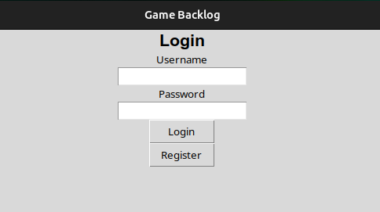
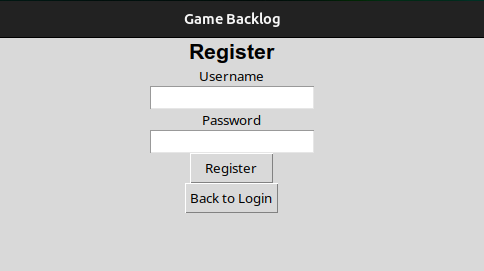
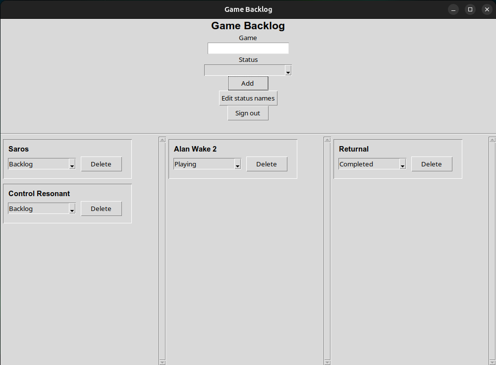
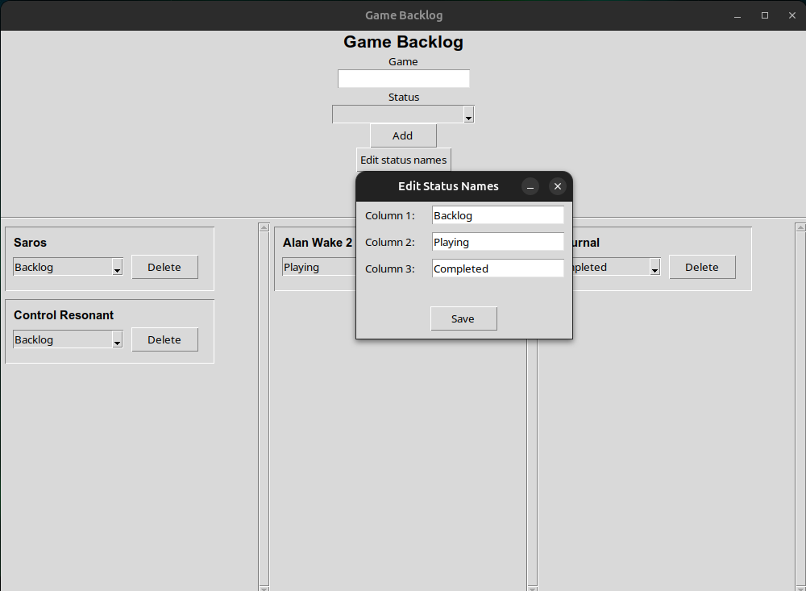

# Käyttöohje

## Sovelluksen käynnistäminen
Asenna riippuvuudet:
```
poetry install
```
Alusta tietokanta:
```
poetry run invoke build
```
Käynnistä sovellus:
```
poetry run invoke start
```

## Kirjautuminen
Käynnistämisen jälkeen näkyy sisäänkirjautumisnäkymä:



Sisäänkirjautuminen tapahtuu kirjoittamalla käyttäjänimi ja salasana niille tarkoitettuihin kenttiin ja painamalla "Login" nappia.

## Rekisteröinti
Uuden käyttäjän voi luoda painamalla "Register" nappia, joka vie rekisteröintinäkymään:



Uuden käyttäjän saa luotua kirjoittamalla haluttu käyttäjänimi ja salasana niille tarkoitettuihin kenttiin ja painamalla "Register" nappia. Jos rekisteröinti onnistuu, niin sovellus palauttaa takaisin sisäänkirjautumisnäkymään.

Takaisin sisäänkirjautumisnäkymään pääsee painamalla "Back to Login" nappia.

## Backlog

Sisäänkirjautumisen jälkeen avautuu backlog-näkymä:



Backlog-näkymästä voi palata takaisin sisäänkirjautumisnäkymään eli kirjautua ulos painamalla "Sign out" nappia.

### Pelien lisääminen ja poistaminen
Backlog näkymässä voi lisätä pelin omaan backlogiin kirjoittamalla pelin nimen ja valitsemalla pelille tilan ja painamalla "Add" nappia. Tämän jälkeen peli näkyy backlogissa. Pelin voi poistaa backlogista painamalla sen tilan vieressä olevaa "Delete" nappia.

### Pelin tilan muuttaminen
Pelin tilaa voi muuttaa painamalla pelin nimen alla olevaa tilan nimeä, jolloin tilan voi valita samalla tavalla kuin peliä lisätessä.

## Tilojen nimien muuttaminen
Painamalla "Edit status names" nappia avautuu ikkunna tilojen nimien muokkaamiselle:



Tilojen nimiä voi muokata kirjoittamalla kenttiin ja painamalla "Save" nappia, jolloin uudet tilojen nimet päivittyvät backlogiin.
